# percobaan 1

pada percobaan ini terdapat tag 'script untuk pemanggilan fungsi JavaScript yang terdapat pada bagian kepala dan body dengan document.write("...") untuk mencetak teks.

# percobaan 2

terdapat event onclick yang akan menampilkan nama dengan bantuan fungsi tampilkan_nama() dalam script untuk ditambahkan ke elemen 
 yang memiliki id="hasil".

# percobaan 3
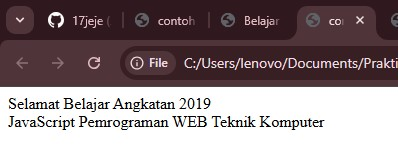
pada percobaan ini mencetak "Selamat Belajar Angkatan 2019" dan "JavaScript Pemrograman WEB Teknik Komputer" dengan menggunakan document.write("..") 

# percobaan 4
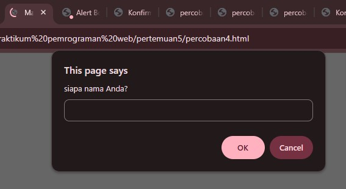
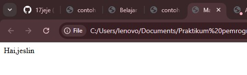
pada percobaan ini terdapat fungsi prompt untuk meminta user memasukkan nama. setelah itu, input dari user disimpan ke variabel nama dan akan dicetak menggunakan document.write("..") dengan tambahan "hai"

# percobaan 5
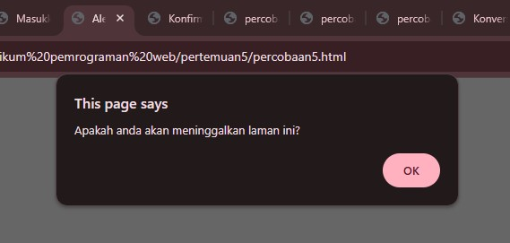
pada percobaan ini terdapat fungsi window.alert() yang jika halaman browser dibuka maka akan muncul kotak dialog dengan pesan "apakah anda akan meninggalkan laman ini?" dan harus mengklik ok untuk melanjutkan interaksi

# percobaan 6
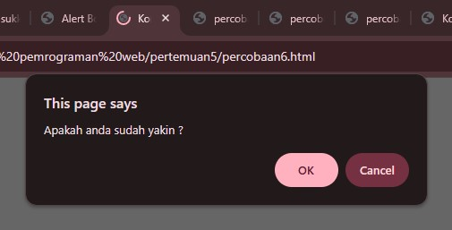
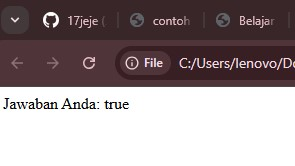
pada percobaan ini terdapat fungsi window.confirm() untuk menampilkan pesan "apakah anda sudah yakin?" dengan pilihan ok dan cancel. Jika pengguna menekan OK, maka variabel jawaban bernilai true; jika menekan Cancel, maka nilainya false.

# percobaan 7

pada percobaan ini terdapat variabel "variabelku" tanpa nilai dan "variabelku2" dengan nilai 3 lalu "variabelku" diberi nilai 1234 dan pada document.write() akan diproses perkalian antara variabelku dan variavelku2 menjadi 1234 dikali 3 menjadikan 3702 yang akan dicetak atau muncul dihalaman

# percobaan 8
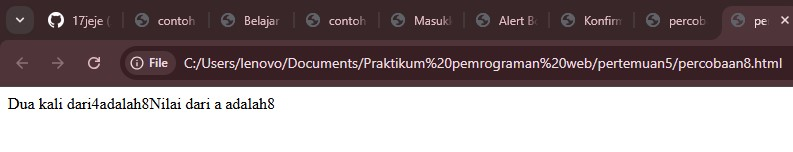
menggunakan fungsi dan variabel global yang awalnya a = 12 dan b = 4. lalu terdapat fungsi Perkalian_Dengan2(b) menerima parameter yang menghitung b*2 dan menampungnya di a dan mengembalikan nilai a. setelah itu akan tercetak "Dua kali dari",b,"adalah",Perkalian_Dengan2(b) dimana b adalah 4 dan Perkalian_Dengan2(b) adalah 8. lalu "Nilai dari a adalah",a dimana a dari variabel global ke fungsi menjadi 8.

# percobaan 9
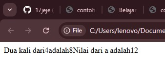
percobaan ini memperlihatkan perbedaan variabel lokal dan global dimana variabel lokal hanya berlaku dalam fungsi dan tidak mempengaruhi variabel global sedangkan variabel global a tetap 12, sehingga ketika muncull hasilnya tetap 12.

# percobaan 10
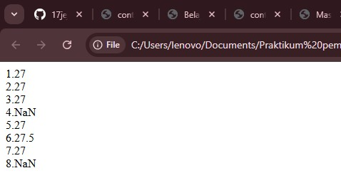
terdapat fugsi parseInt dan parseFloat yang berguna untuk mengkonversi string menjadi bilangan. contohnya jika parseInt("27.5") maka yang muncul hanya bilangan bulat saja sedangkan parseFloat bisa membaca desimal.

# percobaan 11
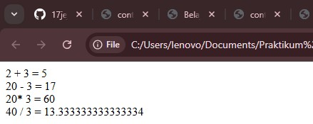
pada percobaan 11 terdapat penggunaan aritmatika dasar seperti penjumlahan, pengurangan, perkalian, dan pembagian.

# percobaan 12
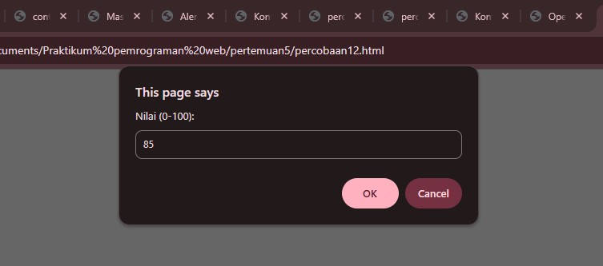
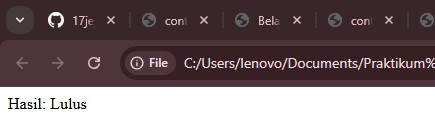
terdapat operator ternary sebagai alternatif penulisan if-else yang lebih singkat. Pertama, program meminta input dari pengguna melalui prompt("Nilai (0-100): ", 0), lalu menyimpannya di variabel nilai. Setelah itu, dilakukan pengecekan kondisi (nilai >= 60). Jika kondisi benar, maka variabel hasil berisi string "Lulus", sedangkan jika salah berisi "Tidak Lulus".

# Analisis Portofolio JavaScript
saya memberikan sedikit javascript pada formulir kontak berupa event onsubmit yaitu respon otomatis yang dipicu dari user. Saat pengguna klik "kirim pesan" akan ditampilkan kotak dialog pemberitahuan sebagai umpan balik bahwa pesan sudah terkirim dengan alert('Terima kasih! Pesan Anda Terkirim.') dan return false hingga aksinya dicegah dan tidak mengirim data ke server dan halaman tidak akan reload.